# cogsi2526-1201264-1210901-1210902
## CA2 Part 2
### Self-evaluation
Hélder Rocha (1210901) - 33,33% 
Pedro Teixeira (1210902) - 33,33% 
Francisco Gouveia(1201264) - 33,33%
## Technical Report

- ### Description of analysis
Analisámos os objetivos definidos para a Parte 2 da CA2 e concluímos que seria necessário converter a aplicação Spring Boot de Maven para Gradle, configurando adequadamente o sistema de build e as suas dependências.

### Implementation

#### Part 2

- 1 - Navegamos para a pasta `links` da aplicação "Building REST services with Spring" e executamos a aplicação com Maven usando o comando `../mvnw spring-boot:run`. Acedemos ao URL `http://localhost:8080/employees` no browser para verificar que a aplicação estava a funcionar corretamente.

- 2 - Criamos o diretório CA2-part2 (mkdir CA2-part2) e inicializamos um novo projeto Gradle usando o comando `gradle init`. Selecionamos as seguintes opções:
    - Type of project: basic (estavamos a ter problemas ao selecionar o tipo application)
    - Build script DSL: Groovy

- 3 - Copiamos o conteúdo da pasta `src` da aplicação original (pasta `links`) para a pasta `src` do novo projeto Gradle.

- 4 - Atualizamos o ficheiro `build.gradle` para incluir todos os plugins e dependências necessários para a aplicação Spring Boot:
    - Plugin `java`
    - Plugin `org.springframework.boot`
    - Plugin `io.spring.dependency-management`
    - Dependências: spring-boot-starter-data-jpa, spring-boot-starter-web, spring-boot-starter-hateoas, com.h2database:h2
    - Configuramos a versão do Spring Boot e a Java toolchain

- 5 - Executamos o comando `./gradlew build` para compilar o projeto e verificar que todas as dependências foram corretamente configuradas.

- 6 - Executamos a aplicação usando o comando `./gradlew bootRun` e testamos no browser através do URL `http://localhost:8080/employees` para confirmar que a migração foi bem-sucedida.

- 7 - Fizemos commit e push das alterações realizadas até este ponto.

- 8 - Criamos a custom task `deployToDev` no ficheiro `build.gradle`. Esta task orquestra todo o processo de deployment e depende de várias sub-tasks que executam as seguintes operações em sequência:
    - **cleanDeployment** (Delete): Elimina o diretório `./deployment/dev` para garantir um deployment limpo
    - **copyAppArtifact** (Copy): Depende de `cleanDeployment` e `build`. Copia o ficheiro JAR da aplicação de `build/libs` para o diretório de deployment
    - **copyRuntimeLibs** (Copy): Depende de `copyAppArtifact`. Copia todas as dependências runtime (obtidas através de `configurations.runtimeClasspath`) para o subdiretório `./deployment/dev/lib`
    - **copyConfigs** (Copy): Depende de `copyRuntimeLibs`. Copia os ficheiros de configuração (*.properties) de `src/main/resources` para o diretório de deployment, aplicando o filtro `ReplaceTokens` para injetar dinamicamente a versão do projeto e um timestamp da build no formato "yyyy-MM-dd HH:mm:ss"
    - A task principal `deployToDev` imprime uma mensagem de confirmação no final, indicando o sucesso do deployment e o caminho do diretório

- 9 - Testamos a task `deployToDev` executando `./gradlew deployToDev` e verificamos que:
    - Todos os ficheiros foram corretamente copiados para `./deployment/dev`
    - As dependências foram colocadas no subdiretório `lib`

- 10 - Substituímos o plugin `java` pelo `application` (application contém o java) no ficheiro `build.gradle` e configuramos a classe principal da aplicação (`mainClass = 'payroll.PayrollApplication'`). Isto permite ao Gradle gerar scripts de distribuição através da task `installDist`.

- 11 - Criamos a custom task `runFromDist` que depende da task `installDist`. Esta task:
    - Deteta automaticamente o sistema operativo usando `System.getProperty("os.name")`
    - Define o caminho do script executável baseado no OS (`.bat` para Windows, script bash para Unix/Linux/Mac)
    - Executa a aplicação usando o script de distribuição gerado em `build/install/${project.name}/bin/`
    - Utiliza `exec` com `cmd /c` para Windows ou `bash -c` para sistemas Unix

- 12 - Testamos a task `runFromDist` executando `./gradlew runFromDist` e confirmamos que a aplicação arranca corretamente usando os scripts de distribuição gerados.

- 13 - Criamos a custom task `packageJavadoc` do tipo `Zip` que depende da task `javadoc`. Esta task:
    - Gera a documentação Javadoc do projeto (através da dependência da task `javadoc`)
    - Comprime toda a documentação gerada (localizada em `/docs/javadoc`) num ficheiro ZIP
    - Guarda o ficheiro ZIP no diretório `./distributions` com o nome `${project.name}-javadoc.zip`
    - Foi adicionada ao grupo "documentation" para melhor organização

- 14 - Executamos `./gradlew packageJavadoc` para testar a geração e empacotamento da documentação. Verificamos que o ficheiro ZIP foi criado corretamente em `./distributions`.

- 15 - Criamos um novo source set chamado `integrationTest` no ficheiro `build.gradle`:
    - Configuramos os diretórios de código (`src/integrationTest/java`) e recursos (`src/integrationTest/resources`)
    - Definimos o classpath para incluir as dependências de compilação e runtime, bem como o output das classes principais

- 16 - Adicionamos as dependências necessárias para os testes de integração na configuração `integrationTestImplementation`, incluindo JUnit e Spring Boot Test.

- 17 - Criamos o diretório `src/integrationTest/java` e adicionamos uma classe de teste de integração simples que verifica o comportamento da aplicação com a base de dados H2.

- 18 - Criamos uma custom task `integrationTest` do tipo `Test` que:
    - Define o classpath apropriado usando o source set `integrationTest`
    - Executa os testes de integração
    - Gera relatórios no diretório `build/reports/integrationTests`

- 19 - Executamos `./gradlew integrationTest` para verificar que os testes de integração são executados com sucesso.

- 20 - Fizemos commit final de todas as alterações e adicionamos a tag `ca2-part2` ao repositório.

#### Alternativas
### Ant
## Comparison Between Gradle and Ant

Gradle and  Ant are build automation tools for Java allowing to standardize builds and make them faster.
Ant is one of the oldest build tools known for it's highly controllable way to define builds being still used in simpler projects.
Gradle is more modern simplified approach focused on scripting that allows for more advanced features.

| **Factors**               | **Gradle**                                                                                                                      | **Ant**                                                                                         |
|:--------------------------|:--------------------------------------------------------------------------------------------------------------------------------|:------------------------------------------------------------------------------------------------|
| **Configuration**         | Groovy or Kotlin — relatibly concise and easier to understand.                                                                  | XML — very verbose,everything has to be typed                                                   |
| **Dependency Management** | Built-in dependency resolution                                                                                                  | No native dependency management but Ivy is used                                                                |
| **Tasks**                 | very flexible and easy to create custom tasks                                                                                   | More complext to configure                                                                      |
| **Performance**           | Incremental builds and caching reduce work and speed up repeated builds.                                                        | No built-in incremental build/caching         |

## Implementation
# Part 1
We needed to create an alternative build solution for the sprint using Apache Ant. Unlike Gradle, to manage dependencies, Ant requires an external tool in our case Apache Ivy.
The first step was to translate Gradle's dependencies block into a ivy.xml file
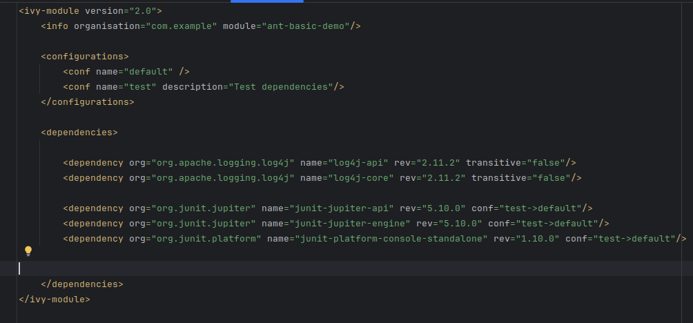

We created a build.xml file to define the build lifecycle.
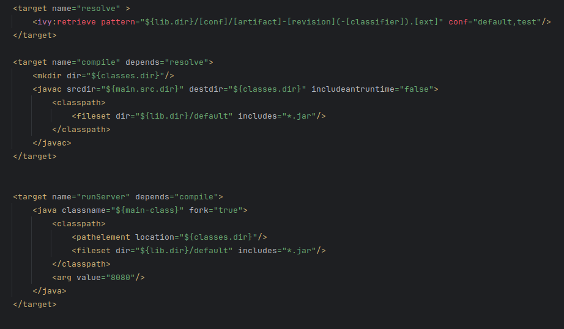

- *Resolve* target: downloads the dependencies specified in ivy.xml and organizes them in the right lib destination.
- *Compile* target: takes the .java files,converts them into jvm readable format(bytecode) and puts them in right folder.
- *run server* runs the main class with the arguments required knowing where to find the needed files because of the classpath.

*Running Tests*
This task compiles the files in the test folder to bytecode then uses the junitlauncher,a Junit 5 specific task, to run tests finding them with the fileset.

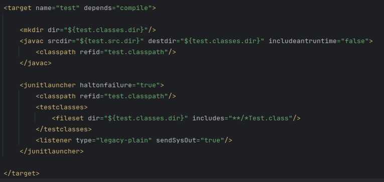

*Backing up code*
Uses the built it copy function to copy the files to a backup destination

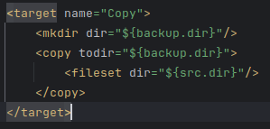

*zipping the backup*
Using the zip function to zip the backup and send it to the backup location

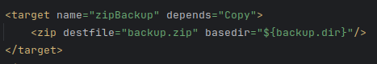
# Part 2

Just like in part1 we needed to translate build.gralde into build.xml and ivy.xml follow similar logic to part1.

*DeployToDev*
The Task DeployToDev was created based on several smaller targets(taks):
1. *jar:* Packages the app into a jar file

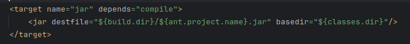

2. *clean-deploy:* deletes the deployment directory to ensure the deployment only uses current files.

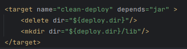

3. *copy-to-deploy:* copies the jar and the runtime dependencies to the deployment directory

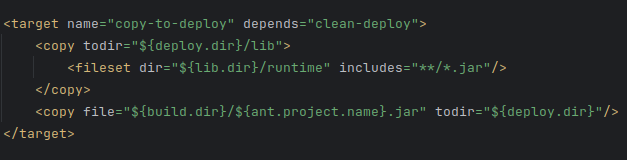

4. *deployToDev:* This is the main target that depends on all the previous ones and alters current built timestamp and the project version.

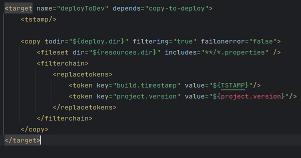

*InstallDIst task*
1. *InstallDist:* This target copys the deployment version and the OS.specific scrips(run.sh, run.bat) into a final repository(/install).

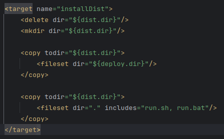

2. *runFromDist:* This target creates runs the appropriate script with the appropriate commands depending on the OS using the <condition> task
to test this condition(<os family="unix"/>).

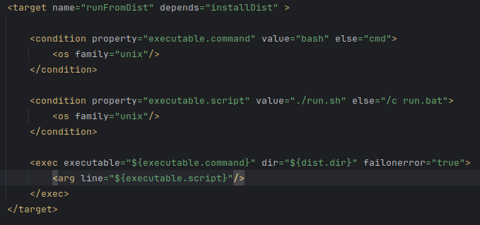

*Javadocs target:* In this Target we generate javadoc using the builtin Task and zip it to the pretended directory.

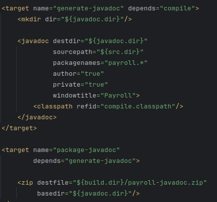

